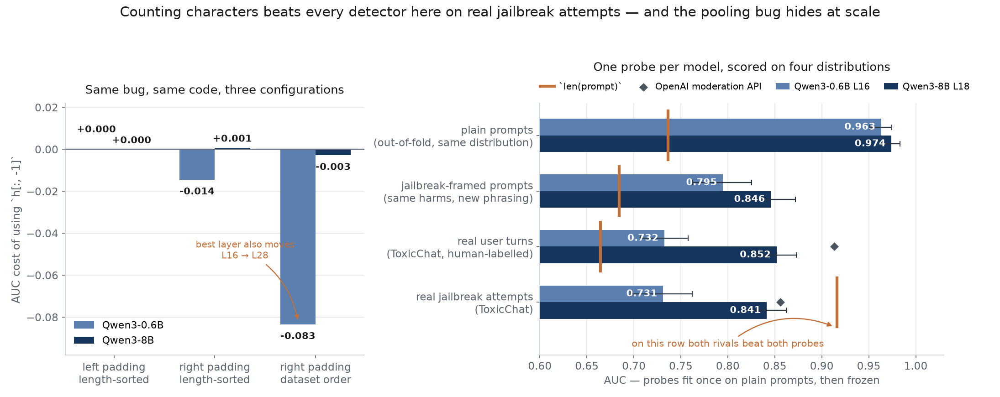

# Counting characters beats a commercial moderation API

Infrastructure for training and evaluating probes on a language model's internal
activations — the lightweight detectors a safety team runs instead of a second
large model. An activation cache keyed on everything that can move a number, a
layer × pooling sweep that never touches a GPU twice, and a control suite that
runs before any result is readable.

**The headline is a baseline, not a result.** On ToxicChat's 2,803 human-labelled
user turns, `len(prompt)` scores **0.916 AUC** at detecting jailbreak attempts.
The OpenAI moderation API, whose own scores ship with that dataset, manages
**0.856**. An 8B probe on model internals manages **0.841**.

Three detectors — one of them commercial and deployed — all beaten by counting
the characters in the prompt. Nobody reports that, because nobody runs the
trivial baseline.



Two further findings, both infrastructure problems rather than research ones:

1. **A pooling bug that costs 0.083 AUC on a 0.6B model and 0.003 on an 8B.**
   Same code, same weights, three configurations — and the variable that hides
   it is model size, so testing on your production model is exactly how you
   miss it.
2. **Two label columns over the same prompts ran the model twice**, because the
   cache key included the label set. Activations do not depend on labels; that
   was 29% of GPU time on both models.

Everything ran on a MacBook via MPS. **90 seconds of forward passes for the
0.6B, 715 for the 8B.** Nothing rented, $0 spent. Every number after extraction
is CPU.

## Setup

| | |
|---|---|
| Models | Qwen3-0.6B and Qwen3-8B, fp16 (`MODEL=` is the only thing that changes it) |
| Features | residual stream at every layer, 4 poolings, cached once per model |
| Probe | logistic regression on standardised features, 5-fold out-of-fold |
| Train | WildGuard plain prompts, n=903, 45.7% harmful |
| Shift | WildGuard jailbreak-framed prompts, n=796 — same harms, new phrasing |
| OOD | ToxicChat, n=2,803 real user turns, **human**-annotated |
| Rivals | `len(prompt)`, and the OpenAI moderation scores ToxicChat ships |
| Interval | stratified bootstrap, 600 draws |

## Generalisation — one probe per model, fit once on plain prompts

| scored on | n | Qwen3-0.6B L16 | Qwen3-8B L18 | `len(prompt)` | moderation API |
|---|---|---|---|---|---|
| plain prompts (out-of-fold) | 903 | 0.963 | **0.974** | 0.737 | — |
| jailbreak-framed prompts | 796 | 0.795 | **0.846** | 0.684 | — |
| real user turns, toxicity | 2803 | 0.732 | **0.852** | 0.664 | **0.913** |
| real jailbreak attempts | 2803 | 0.731 | 0.841 | **0.916** | 0.856 |

Read the rows in order. Scale buys a lot — the 8B probe gains 12 points on real
user turns over the 0.6B — and on three of four rows the probe clears both
rivals or comes close.

Then the bottom row. Real jailbreak attempts are *long*: DAN-style preambles,
nested roleplay, pasted system prompts. Length is therefore an extremely strong
signal in that distribution, the probes never learned it because their training
split did not contain it, and the moderation API does not appear to use it
either. Reported without the baseline, 0.841 reads as a working jailbreak
detector. Reported with it, it is a reason not to ship.

Note what the controls did *not* do: on the plain-prompt split they **cleared**
the probe. Within each length quartile it still scores 0.936–0.958, so there the
0.963 is not a length detector. A control suite that found a problem everywhere
would be useless.

## The `h[:, -1]` pooling bug, priced six ways

`h[:, -1]` and `h.mean(1)` are what most code does. Both are wrong on a padded
sequence. Both are cached here beside the correct versions, so the cost is a
measured number rather than an assertion.

| configuration | Qwen3-0.6B cost (pad) | Qwen3-8B cost (pad) |
|---|---|---|
| left padding, length-sorted | **+0.000** (2.3%) | **+0.000** (0.8%) |
| right padding, length-sorted | **−0.014** (2.3%) | **+0.001** (0.8%) |
| right padding, dataset order | **−0.083**, L16→L28 (29.0%) | **−0.003**, L18→L19 (22.3%) |

cost = `h[:, -1]` minus `last`, each at its own best layer.

Three things worth saying out loud:

- **Under left padding the bug is free on both models.** `h[:, -1]` lands on the
  last real token by accident and the two arrays are bit-identical. A reviewer
  checking the number would find nothing.
- **The cost is set by the batching strategy**, chosen for throughput by someone
  not thinking about pooling. Length-sorting is a good idea that makes a
  correctness bug 6× smaller and correspondingly harder to find.
- **Model size hides it.** The configuration that costs 8.3 points at 0.6B costs
  0.3 at 8B. I would not have found this had I started at 8B, and the honest
  reading is that *the metric cannot be trusted to surface this class of bug at
  all* — which is why `tests/test_pooling.py` pins the arithmetic on a
  hand-built tensor instead.

It also moves the answer, not just the score: in the worst row the apparent best
layer moves from 16 to 28, so a figure captioned "harm is represented in the late
layers" would be reporting padding.

## Extraction — the only step that needs a GPU

| model | prompt set | n | padding | batching | pad tokens | prompts/s | wall |
|---|---|---|---|---|---|---|---|
| Qwen3-0.6B | wildguard-vanilla | 903 | left | length-sorted | 2.3% | 117.9 | 7.7s |
| Qwen3-0.6B | wildguard-adversarial | 796 | left | length-sorted | 1.5% | 29.2 | 27.2s |
| Qwen3-0.6B | toxicchat (both label cols) | 2803 | left | length-sorted | 2.1% | 75.3 | 37.2s |
| Qwen3-0.6B | wildguard-vanilla | 903 | right | length-sorted | 2.3% | 106.2 | 8.5s |
| Qwen3-0.6B | wildguard-vanilla | 903 | right | dataset order | 29.0% | 99.3 | 9.1s |
| Qwen3-8B | wildguard-vanilla | 903 | left | length-sorted | 0.8% | 14.3 | 63.1s |
| Qwen3-8B | wildguard-adversarial | 796 | left | length-sorted | 0.8% | 3.4 | 231.5s |
| Qwen3-8B | toxicchat (both label cols) | 2803 | left | length-sorted | 1.2% | 9.7 | 288.2s |
| Qwen3-8B | wildguard-vanilla | 903 | right | length-sorted | 0.8% | 15.0 | 60.0s |
| Qwen3-8B | wildguard-vanilla | 903 | right | dataset order | 22.3% | 12.5 | 72.4s |

**90s and 715s of forward passes.** Then **116 and 148 (layer, pooling) probes in
35s and 67s of CPU with the GPU idle** — that ratio is the only reason to build a
cache.

Length-sorted batching cuts padding from 29.0% to 2.3% on the 0.6B. On the
matched pair (right padding, sorted vs unsorted) that is worth 6.5% of wall
clock — a small forward pass on MPS is dominated by per-kernel overhead rather
than by tokens, so the **padding fraction** is the figure that transfers to a
rented GPU, not the speedup.

## Layer sweep

| | Qwen3-0.6B | Qwen3-8B |
|---|---|---|
| best `mean` | **0.963** at L15 | **0.977** at L20 |
| best `last` | 0.955 at L16 | 0.977 at L18 |
| layer 0 (embeddings, no block has run) | 0.877 | 0.896 |
| length floor | 0.737 | 0.737 |

Layer 0 is the embedding output. On the 8B, a bag of token embeddings already
scores **0.896** against a 0.737 floor — the 36 transformer blocks add 0.081. Most
of what this probe detects is lexical, which is worth knowing before describing
it as reading the model's internal representation of harm.

## The controls

| control | rules out | 0.6B | 8B |
|---|---|---|---|
| `length_only` | the probe is a length detector | **0.737** | **0.737** |
| `shuffled_labels` | the evaluation leaks | 0.503 — PASS | 0.497 — PASS |
| `random_features` | the harness itself is broken | 0.511 — PASS | 0.521 — PASS |
| `length_matched` | length explains the within-split result | 0.936–0.958 | — |

`python -m probeinfra controls` **exits non-zero when a control fails**, so it
belongs in CI rather than a notebook. That is the difference between a check and
a habit.

`length_matched` stratifies rather than residualises, on purpose. Fitting length
out linearly over-corrects — on an earlier project that flipped the sign of the
effect being measured — so the conservative form of the question gets asked
instead, and a length band containing only one class is reported `n/a` rather
than quietly dropped.

## The cache key is the whole argument

```python
CacheKey(model_id, model_sha, tokenizer_sha, dtype, layers, poolings,
         padding_side, max_length, chat_template_sha,
         prompt_set, prompt_fingerprint, schema, extras)
```

`model_id` is not an identity: `"Qwen/Qwen3-8B"` resolves to different weights
across a repo revision. `model_sha` is the **resolved commit**, so a model that
moved under you is a cache *miss*, not a silent hit. Everything else in that list
changes activations too — dtype changes rounding, `padding_side` changes which
vector `h[:, -1]` reads, `max_length` changes which prompts lose their tail, and
`extras["length_sorted"]` changes how much padding each row sees.

Two things are deliberately **excluded**:

- **`prompt_set` is in the manifest and out of the digest.** ToxicChat's
  `toxicity` and `jailbreaking` columns annotate the same 2,803 user turns. Keyed
  on the set name they asked for two digests and the model ran twice for
  byte-identical output — **37 of 127 seconds on the 0.6B, 288 of 1,003 on the
  8B. 29% of GPU time, both times.** Prompts are already identified by a hash of
  their text.
- **Nothing about the probe.** Fitting is cheap and extraction is not; a new
  regularisation strength must never trigger a forward pass.

Three design facts, each of which came out of a bug:

1. **The key is computable without the weights.** The first version built it
   inside the extraction function from the loaded tokenizer, so nothing could
   look up the cache without a GPU — and the lookup path built a *second* key
   with a different tokenizer hash, so every `sweep` reported a miss on what
   `extract` had just written. A cache whose key is not reproducible is not a
   cache.
2. **`verify()` re-reads the stored key and compares it field by field** on every
   read. The threat is not a digest collision; it is someone editing a field,
   reusing the directory, and getting an answer about the old configuration.
3. **Array shape is checked against the key on write.** An array whose layer
   count disagrees with `key.layers` would index cleanly and mean something else.

### Why `hidden_states` and not forward hooks

Hooks are the usual answer and they are where off-by-one layer indexing comes
from: a hook on `model.layers[k]` fires on that block's *output*, which is the
residual stream entering block k+1. `hidden_states[k]` is unambiguous — 0 is the
embedding output, k is the output of block k. A layer number in a figure should
mean one thing.

## What is in here

| | |
|---|---|
| `probeinfra/cache.py` | content-addressed activation cache; the key is the design |
| `probeinfra/extract.py` | one forward pass, every layer, four poolings, length-sorted batches |
| `probeinfra/probe.py` | logistic probe, stratified bootstrap AUC, three eval settings |
| `probeinfra/controls.py` | the four controls, and why one stratifies instead of residualising |
| `probeinfra/baselines.py` | the two rivals: `len(prompt)` and the moderation scores ToxicChat ships |
| `probeinfra/data.py` | loaders that refuse nulls and deduplicate prompts |
| `probeinfra/cli.py` | `extract` / `sweep` / `controls` / `transfer` |
| `tests/` | 43 tests, most of them about the ways a probe pipeline lies |

```bash
pip install -e .
python -m probeinfra extract  --model Qwen/Qwen3-8B --set wildguard-vanilla   # the only GPU step
python -m probeinfra sweep    --model Qwen/Qwen3-8B --set wildguard-vanilla   # 148 probes, CPU
python -m probeinfra controls --model Qwen/Qwen3-8B --layer 18 --pooling mean # exits 1 on failure
python -m probeinfra transfer --model Qwen/Qwen3-8B --layer 18 --pooling mean
MODEL=Qwen/Qwen3-8B BS=4 LAYER=18 ./run_all.sh                                # all of the above
python tables.py && python make_figures.py                                    # every number here
```

`tables.py` prints every table in this README from the JSON the runs wrote, so a
re-run that changes a result changes the table rather than silently disagreeing
with the prose.

## Three bugs this repo found in itself

**An fp16 sanity check that could not fail.** `extract` asserts no prompt produced
an all-zero activation, via `np.abs(out).sum(...)`. Summed over 29 layers × 4
poolings × 1024 hidden, ordinary activations pass fp16's 65504 ceiling, so the
reduction returned `inf` — and `inf > 0` is `True`. The guard passed on every
input including a genuinely empty one. One `astype(np.float32)`.

**A cache that could not be looked up.** Described above. It produced the design
rule the rest of the repo is built on: the key is derived from config and
tokenizer metadata, never from the loaded model, and exactly one function
computes it.

**A transfer filename with no model in it.** `transfer_L16_mean_left.json` — two
models were distinguishable only because their best layers happened to differ. Two
models sharing a best layer would have overwritten each other silently.

All three are regression-tested.

## Honest limitations

- **The labels are model-produced on the training side.** WildGuard's prompt-harm
  labels come from GPT-4, audited at 92% agreement with human annotators on a
  500-item sample. That agreement rate is a ceiling on any AUC measured against
  them and is not estimated here. ToxicChat's labels *are* human, which is why it
  is the out-of-distribution set rather than the training one.
- **The moderation-API comparison is not like-for-like.** Those scores were
  collected by the dataset authors at an unknown date against an unknown endpoint
  version, and the API is built for a content-policy taxonomy rather than for
  jailbreak detection. It is a useful reference point, not a benchmark result.
- **One model family, one task.** The stack is model-agnostic — `MODEL=` is the
  only thing `run_all.sh` needs — but every number here is Qwen3.
- **A linear probe is the floor of this method, not its ceiling.** Attention
  probes and small MLPs do better in the literature; the harness fits whatever
  `fit_probe` returns.
- **The shift result is not diagnosed.** Whether the drop from 0.974 to 0.846 is
  the probe, the 6× length difference between the splits, or genuinely different
  internal representations is not resolved — the length-matched control narrows
  it and does not settle it.
- **`max_length=1024` truncates.** The adversarial split reaches 3,013 characters
  and a handful of prompts lose their tail. Truncation length is in the cache
  key, so raising it is a new key rather than a silent change.
- **`peak_mem_gb` logs 0.0 on MPS.** It reads `torch.cuda.max_memory_allocated()`,
  which has no Metal equivalent wired up. The field is meaningless on this
  hardware and should not be quoted.

## Data

- [`walledai/WildGuardTest`](https://huggingface.co/datasets/walledai/WildGuardTest)
  — 1,699 usable prompts (26 ship a null label and are dropped, not cast)
- [`lmsys/toxic-chat`](https://huggingface.co/datasets/lmsys/toxic-chat)
  — 2,803 human-annotated user turns, 12.6% toxic, 3.2% jailbreak attempts,
  shipped with the moderation scores used as a rival above

Both are public safety-research datasets. This repo trains detectors on them; it
does not generate, improve, or evaluate attacks.
